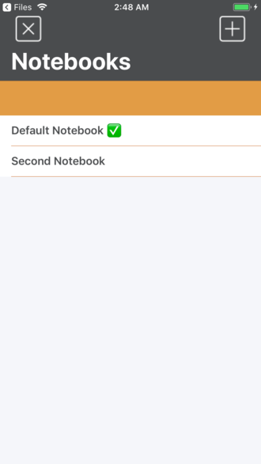

# Everpoor
> Aplicación para crear notas y libros de notas que trata de imitar algunas de las funcionalidades de EverNote.

Esta aplicación ha sido realizada con Swift4.

## Usage example

Esta aplicación utiliza el framework CoreData para guardar en la memoria del dispositivo notebooks y notas. Cada nota pertenercerá a un libro de notas y un libro de notas puede tener una o varias notas.

Las notas tienen implementado el almacenamiento con CoreData del título, el libro de notas, el texto y la imagen. La aplicación esta preparada para implementar geolocalización con CoreLocation pero todavía no se ha implementado la funcionalidad de guardar dichos datos en Core Data.

## Principales características

- Uso de CoreData
- Uso de CoreLocation
- Uso de Swift4
- Aplicación creada programáticamente, no se utilizan storyboards ni xibs.

